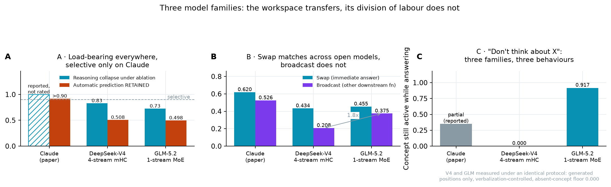

# jacobian-lens-open-frontier

**The Jacobian lens on open frontier-scale models.** A research fork of Anthropic's `jlens`,
extended to two open-weight models large enough to test the global-workspace claims, and used
to re-run the experiments from *Verbalizable Representations Form a Global Workspace in
Language Models*.

[](https://xiangchensong.github.io/blog/2026/jacobian-lens-global-workspace/)
[](https://github.com/xiangchensong/jacobian-lens-open-frontier)
[](https://huggingface.co/xiangchensong/jacobian-lens-deepseek-v4-flash-0731)
[](https://huggingface.co/xiangchensong/jacobian-lens-deepseek-v4-flash-preview)
[](https://huggingface.co/xiangchensong/jacobian-lens-glm-5.2)
[](LICENSE)

| 📝 **Write-up** | [The Jacobian Lens at Frontier Scale](https://xiangchensong.github.io/blog/2026/jacobian-lens-global-workspace/) | the full replication, with controls and retractions |
|---|---|---|
| 🤗 **Fitted lenses** | [DeepSeek-V4-Flash-0731](https://huggingface.co/xiangchensong/jacobian-lens-deepseek-v4-flash-0731) · [DeepSeek-V4-Flash-preview](https://huggingface.co/xiangchensong/jacobian-lens-deepseek-v4-flash-preview) · [GLM-5.2](https://huggingface.co/xiangchensong/jacobian-lens-glm-5.2) | ready to load, no fitting required |
| 🧪 **Experiments** | [`experiments/`](experiments/README.md) | every script, mapped to the section that cites it |

## 🔬 Why

The lens reads out what an internal activation is *disposed* to make a model say — it
transports a residual-stream vector at any layer into the final-layer basis and decodes it with
the model's own unembedding:

```
lens_l(h) = unembed( J_l @ h ),    J_l = E[ ∂h_final / ∂h_l ]
```

`J_l` is a closed-form average of per-prompt Jacobians: no training, no learned parameters.

The paper introducing it runs entirely on Claude, so its claims concern a frontier model while
the evidence cannot be checked independently. Open replications of interpretability results
usually go the other way, onto models small enough that a negative result is ambiguous —
"absent at 100M parameters" and "not real" look the same. We tested the combination in
between: **open weights, frontier scale.**

| model | scale | residual | what it required |
|---|---|---|---|
| DeepSeek-V4-Flash-0731 | 304B total · 43 layers · 256 experts (6+1 active) | **four parallel streams** (hyper-connections) | a rectangular Jacobian `4096×16384` — the square formulation is undefined here |
| GLM-5.2 | 753B total · 78 layers · 256 experts (8+1 active) | single-stream | backward formulas for fp8 kernels that ship without them |

## 📊 What we found



The workspace band, its ignition dynamics, its causal load-bearing role and the ordering of
unspoken intermediates **reproduce on both models**. Ablating the top-10 lens directions across
the band collapses multi-hop reasoning (0.589 → 0.100 on DeepSeek, 0.611 → 0.167 on GLM) while
a matched-rank random ablation leaves it untouched.

The reasoning/prediction **separation does not**. Under the same ablation, automatic next-token
prediction is reported above 0.90 on Claude; we measure 0.508 and 0.498 — two architecturally
unrelated open models landing within 0.010 of each other, both far below. Workspace *existence*
looks architecture-general; the division of labour between the workspace and automatic
processing looks like something scale or training installs.

Told not to think about a concept, the two open models do opposite things: one shows no
detected readout of it (0/13 scenarios), the other reads it out in 11/12. That divergence
survived re-measuring both under a single protocol.

DeepSeek later gave us a control we could not have built: two post-trainings of one reported
base (the V4-Flash preview vs 0731, described by DeepSeek as *"only re-post-trained"*). The
redo **changed the token-level lens readout far more than the lens geometry** — cross-checkpoint
top-1 readout overlap is 0.29 against a same-checkpoint disjoint-corpus floor of 0.59, while
mean CKA is 0.82 against a floor of 0.92 — and the band, ignition, selectivity, white-bear
suppression and J-space compression are all unchanged. See the
write-up update (https://xiangchensong.github.io/blog/2026/jacobian-lens-global-workspace/#update-2026-08-08) and
[`experiments/posttrain_comparison/`](experiments/posttrain_comparison/README.md).

Details, controls, and the experiments that were struck along the way are in the
[write-up](https://xiangchensong.github.io/blog/2026/jacobian-lens-global-workspace/).

## ⚙️ Install

```bash
pip install -e .
```

## 🚀 Usage

Applying a fitted lens:

```python
import transformers, jlens

name = "zai-org/GLM-5.2-FP8"
hf = transformers.AutoModelForCausalLM.from_pretrained(name, dtype="auto", device_map="auto")
tok = transformers.AutoTokenizer.from_pretrained(name)
model = jlens.from_hf(hf, tok)

lens = jlens.JacobianLens.from_pretrained("xiangchensong/jacobian-lens-glm-5.2")
prompt = "calc: 3+4=7\ncalc: 10*2=20\ncalc: 8-3=5\ncalc: (4+17)*2+7="
lens_logits, _, _ = lens.apply(model, prompt, positions=[-1])
for layer, logits in sorted(lens_logits.items()):
    print(layer, [tok.decode([t]) for t in logits[0].topk(5).indices])
```

That is the prompt from experiment 3.5: the unspoken intermediate `21` becomes the lens's
top token around L50 and the answer `49` around L67, in the order the computation requires,
while neither appears in the text.

| 🤗 lens | shape | band | corpus |
|---|---|---|---|
| [`jacobian-lens-deepseek-v4-flash-0731`](https://huggingface.co/xiangchensong/jacobian-lens-deepseek-v4-flash-0731) | `4096×16384` (rectangular) | L19–39 of 43 | n=1000, plus an n=100 fit |
| [`jacobian-lens-deepseek-v4-flash-preview`](https://huggingface.co/xiangchensong/jacobian-lens-deepseek-v4-flash-preview) | `4096×16384` (rectangular) | L19–39 of 43 | n=100 |
| [`jacobian-lens-glm-5.2`](https://huggingface.co/xiangchensong/jacobian-lens-glm-5.2) | `6144×6144` (square) | L34–71 of 78 | n=100 |

The DeepSeek lenses are rectangular (source: the four flattened hyper-connection streams;
target: the stream-collapse output), so loading them requires this fork. The GLM lens is square
and works with upstream `jlens` too. The 0731 repo also ships `lens_disjoint100.pt`, a lens
fitted on disjoint corpus prompts of the same checkpoint — the noise floor behind every
preview-vs-0731 comparison.

Fitting one on a different model:

```python
lens = jlens.fit(model, prompts=my_prompts, checkpoint_path="out/ckpt.pt")
lens.save("out/jacobian_lens.pt")
```

Quality saturates quickly: we measured the curve flat from n=60, and a refit at the paper's
n=1000 moved our headline number by 0.0000. Fitting time is dominated by the model's own
backward pass, and `fit()` is embarrassingly parallel — run it on disjoint prompt slices and
combine with `JacobianLens.merge()`. Fitting on a natively fp8-quantized model additionally
needs `import jlens.fp8_autograd` **before** the model is constructed, so the backward formulas
register first.

## 📁 Repository layout

- **`jlens/`** — the library. Three additions over upstream: a `d_source`/`d_target`
  parameterization so the Jacobian can be rectangular (the square case stays bit-identical and
  passes the original test suite), `intervene.py` for the swap/steer/ablate primitives the
  paper specifies but does not ship, and `fp8_autograd.py`.
- **`experiments/`** — the replication scripts, as run.
  [`experiments/README.md`](experiments/README.md) maps each to its experiment number and to
  the section of the write-up that cites it.
- **`figures/`** — every figure in the write-up, reproducible end-to-end from
  `experiments/figures.py` and the measured values in `experiments/results/`.
- **`walkthrough.ipynb`** — end-to-end notebook: load a model, load or fit a lens, apply it,
  render an interactive layer × position page.

## 📄 Citation

```bibtex
@misc{song2026jacobianlensfrontier,
  author = {Song, Xiangchen and Feng, Fan},
  title  = {The Jacobian Lens at Frontier Scale: Testing the Global Workspace
            on DeepSeek-V4-Flash-0731 and GLM-5.2},
  year   = {2026},
  url    = {https://xiangchensong.github.io/blog/2026/jacobian-lens-global-workspace/}
}
```

For the method itself, cite Anthropic's *Verbalizable Representations Form a Global Workspace
in Language Models* (Transformer Circuits, 2026),
<https://transformer-circuits.pub/2026/workspace/index.html>.

## 🔗 Relationship to upstream

Upstream `jlens` is a frozen reference implementation ("not maintained, not accepting
contributions") released by Anthropic under the Apache License 2.0. This fork keeps that
license and preserves the original code paths; square-Jacobian behaviour is unchanged and
verified by the original tests. The replication, its errors and its conclusions are ours, not
Anthropic's.

## ⚖️ License and data

Code is released under the Apache License 2.0 — see [LICENSE](LICENSE).

The evaluation and experiment prompt sets in [`data/`](data/) are synthetic, authored by
Anthropic, and released under the same license. See the READMEs in
[`data/experiments/`](data/experiments/) and [`data/evaluations/`](data/evaluations/).

The slice-vis pages use [d3](https://github.com/d3/d3) (ISC license). No model weights or text
corpora are bundled; anything downloaded at run time is subject to its own license. The fitted
lenses are expectations of gradients of their base models, both MIT-licensed at the time of
fitting.
